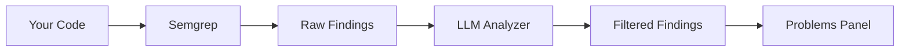

# SemgrepGuard 🛡️

**AI-powered security scanner for VS Code** - Combines Semgrep static analysis with LLM-based false positive filtering to deliver high-quality, actionable security findings.


## Features

- 🔍 **Semgrep Integration** - Run Semgrep static analysis directly from VS Code
- 🤖 **AI-Powered Analysis** - Uses LLM to detect and filter false positives
- 📊 **Confidence Scoring** - Each finding includes confidence scores and reasoning
- 🎯 **Smart Filtering** - Automatically filters out likely false positives
- 📝 **Rich Diagnostics** - Findings appear in Problems panel with inline highlights
- ⚡ **Quick Actions** - One-click fixes, dismissals, and documentation links
- 🌳 **Tree View** - Browse findings organized by file, severity, or rule

## Requirements

- **Semgrep CLI** must be installed:
  ```bash
  # macOS
  brew install semgrep
  
  # pip (any platform)
  pip install semgrep
  ```

- **LLM API Key** (optional, for false positive detection):
  - OpenAI API key, or
  - Google AI (Gemini) API key, or
  - Local Ollama installation

## Quick Start

1. Install the extension
2. Open a project in VS Code
3. Press `Ctrl+Shift+P` and run **"SemgrepGuard: Scan Current File"**
4. View findings in the Problems panel or SemgrepGuard sidebar

## Configuration

| Setting | Default | Description |
|---------|---------|-------------|
| `semgrepGuard.semgrepPath` | `semgrep` | Path to Semgrep executable |
| `semgrepGuard.ruleConfig` | `auto` | Semgrep rule config (e.g., `p/owasp-top-ten`) |
| `semgrepGuard.llmProvider` | `openai` | LLM provider: `openai`, `gemini`, or `ollama` |
| `semgrepGuard.openaiApiKey` | - | OpenAI API key |
| `semgrepGuard.confidenceThreshold` | `70` | Min confidence to show findings (0-100) |
| `semgrepGuard.scanOnSave` | `false` | Auto-scan on file save |
| `semgrepGuard.enableLlmAnalysis` | `true` | Enable LLM analysis |

### Example Configuration

```json
{
  "semgrepGuard.llmProvider": "openai",
  "semgrepGuard.openaiApiKey": "sk-...",
  "semgrepGuard.openaiModel": "gpt-4o-mini",
  "semgrepGuard.ruleConfig": "p/security-audit",
  "semgrepGuard.confidenceThreshold": 70,
  "semgrepGuard.scanOnSave": true
}
```

## Commands

| Command | Description |
|---------|-------------|
| `SemgrepGuard: Scan Current File` | Scan the active file |
| `SemgrepGuard: Scan Workspace` | Scan entire workspace |
| `SemgrepGuard: Clear All Findings` | Clear all findings |

## How It Works



1. **Semgrep scans** your code using security rules
2. **LLM analyzes** each finding with surrounding code context
3. **False positives filtered** based on confidence threshold
4. **Results displayed** in Problems panel with rich diagnostics

## LLM Providers

### OpenAI (Recommended)
```json
{
  "semgrepGuard.llmProvider": "openai",
  "semgrepGuard.openaiApiKey": "sk-...",
  "semgrepGuard.openaiModel": "gpt-4o-mini"
}
```

### Google Gemini
```json
{
  "semgrepGuard.llmProvider": "gemini",
  "semgrepGuard.geminiApiKey": "..."
}
```

### Ollama (Local, Free)
```bash
# Install Ollama first
ollama pull llama3.2
```
```json
{
  "semgrepGuard.llmProvider": "ollama",
  "semgrepGuard.ollamaEndpoint": "http://localhost:11434",
  "semgrepGuard.ollamaModel": "llama3.2"
}
```

## Development

```bash
# Install dependencies
npm install

# Compile TypeScript
npm run compile

# Watch mode
npm run watch

# Launch Extension Host (F5 in VS Code)
```

## License

MIT
# Debugger_Vs_extension
